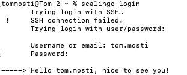
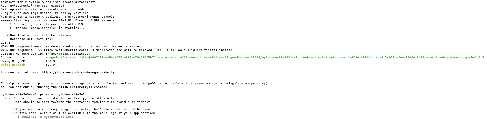
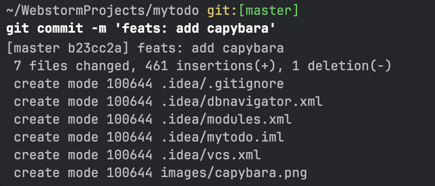
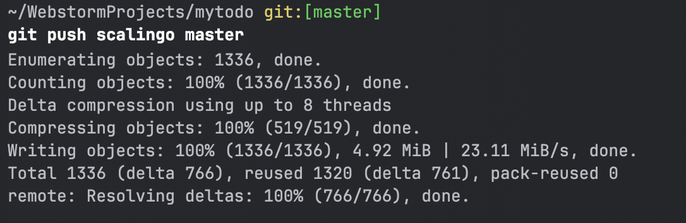
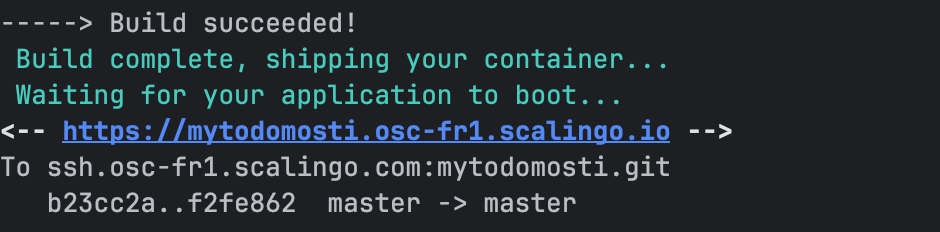
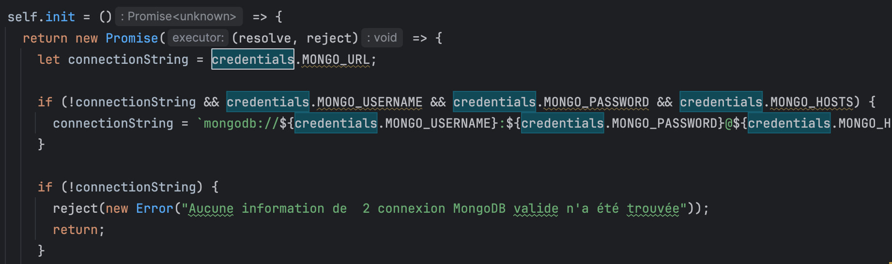
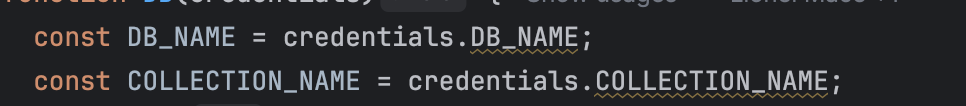
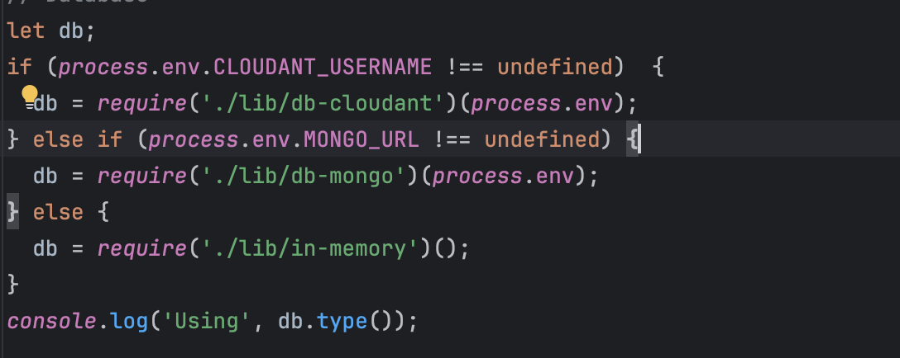
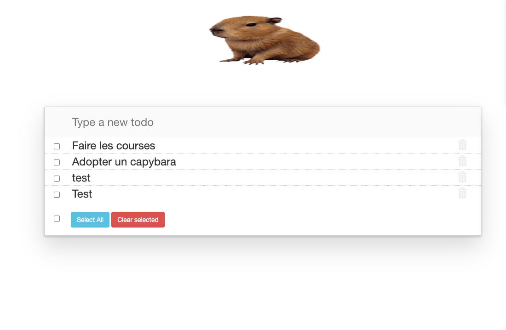

# Connect with Scalingo CLI 

+ i add a ssh key on Scalingo

# Create App on Scalingo

# Now I push on Sclaingo to  trigger deploy

# I change db-mongo.js and server.js to connect with MONGO_URL in .env

+ Change self.init db-mongo.js

+ I also add .env value for collectio nand db name

+ and finally I change the value in server.js
+ 

# Application fonctionnel :
Lien de l'app : https://mytodomosti.osc-fr1.scalingo.io/

